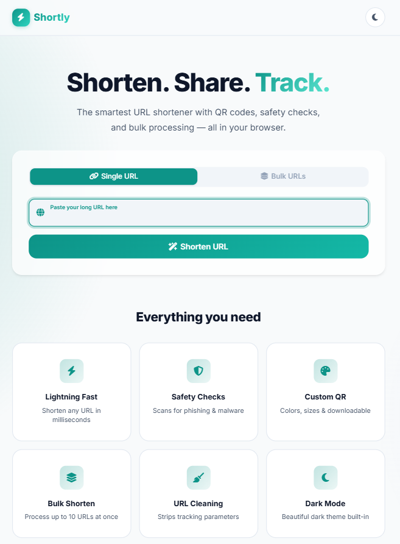

<div align="center">

# ⚡ Shortly

**A smart, modern URL shortener — built entirely in the browser.**

Shorten links, generate custom QR codes, detect unsafe URLs, clean trackers, and more.  
No backend. No signup. Just paste and go.

[](https://ayansahag1010.github.io/Shortly/)
[](https://developer.mozilla.org/en-US/docs/Web/HTML)
[](https://developer.mozilla.org/en-US/docs/Web/CSS)
[](https://developer.mozilla.org/en-US/docs/Web/JavaScript)



</div>

---

## ✨ Features

| Feature | Description |
|---------|-------------|
| 🔗 **Instant Shortening** | Shorten any URL in one click via TinyURL API |
| 🛡️ **Safety Scanner** | Detects phishing domains, suspicious TLDs, and IP-based URLs |
| 🧹 **URL Cleaner** | Strips UTM and tracking parameters automatically |
| 📦 **Bulk Mode** | Shorten up to 10 URLs at once |
| 🎨 **Custom QR Codes** | Pick colors, resize, and download as PNG |
| 🌙 **Dark Mode** | Toggle with persistent local storage preference |
| 📋 **Clipboard Detection** | Prompts to paste URLs copied from elsewhere |
| 🖼️ **Website Previews** | Shows a live screenshot of the destination page |
| 🔍 **Smart URL Preview** | Recognizes YouTube, GitHub, Instagram, Amazon & more |
| 📲 **Social Sharing** | One-click share to WhatsApp, X, Telegram, LinkedIn |
| 🖱️ **Drag & Drop** | Drop a URL anywhere on the page to shorten it |

---

## 🛠️ Tech Stack

- **HTML5** — Semantic, accessible markup
- **CSS3** — Custom properties, glassmorphism, dark mode, responsive grid
- **Vanilla JavaScript** — Zero dependencies, async/await
- **TinyURL API** — URL shortening
- **QR Server API** — QR code generation
- **Thum.io** — Website screenshot previews
- **Font Awesome 6** — Icon library
- **Google Fonts (Inter)** — Typography

---

## 🚀 Getting Started

```bash
# Clone the repository
git clone https://github.com/ayansahag1010/Shortly.git

# Open in browser
cd Shortly
start index.html        # Windows
open index.html         # macOS
xdg-open index.html     # Linux
```

No build tools, no `npm install` — just open `index.html` and it works.

---

## 📁 Folder Structure

```
Shortly/
├── index.html          # Main page
├── style.css           # All styling (light + dark mode)
├── app.js              # Application logic
├── assets/
│   └── preview.png     # Project screenshot
└── README.md
```

---

## 🔮 Future Improvements

- 📊 Click analytics dashboard
- 🔒 Password-protected short links
- 📝 Custom alias support (e.g., `short.ly/my-link`)
- 🕓 Link expiration timers
- 📂 Export shortened links as CSV

---

## 👤 Author

**G Ayan Kumar Saha**  
[github.com/ayansahag1010](https://github.com/ayansahag1010)

---

## 📄 License

This project is open-source and available under the [MIT License](LICENSE).
