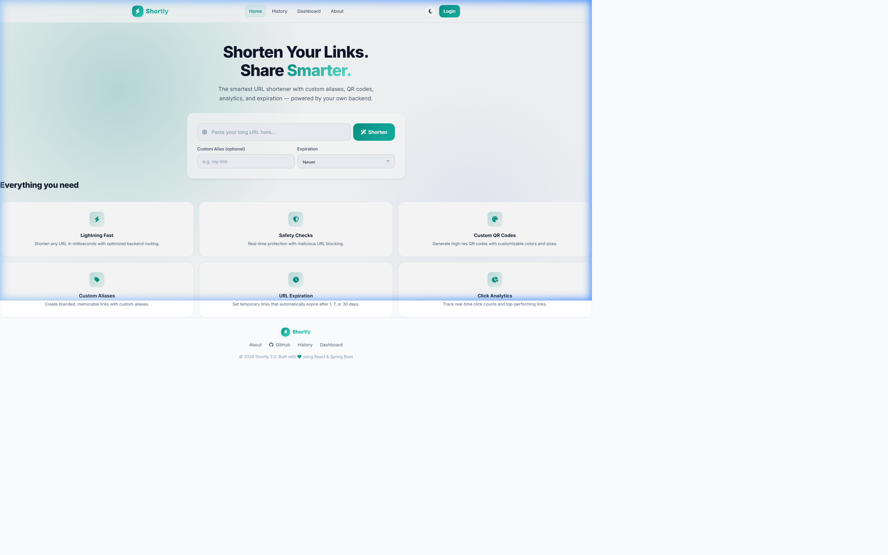

<div align="center">

# ⚡ Shortly

### Modern, High-Performance URL Shortener & Link Management Ecosystem

[](https://ayansahag1010.github.io/Shortly/)
[](https://react.dev/)
[](https://spring.io/projects/spring-boot)
[](https://www.oracle.com/java/)
[](LICENSE)

<br />

<p align="center">
  <a href="#-live-demo">Live Demo</a> •
  <a href="#-editions-overview">Editions</a> •
  <a href="#-key-features">Key Features</a> •
  <a href="#-tech-stack">Tech Stack</a> •
  <a href="#-quick-start">Quick Start</a> •
  <a href="#-api-reference">API Reference</a> •
  <a href="#-author">Author</a>
</p>



</div>

---

## 🌐 Live Demo

| Version | Deployment | Description | Action |
| :--- | :--- | :--- | :--- |
| **Shortly 1.0 (Client-Side)** | **GitHub Pages** | Pure browser-based shortener with TinyURL, QR generator, Safety scanner, and tracker cleaner. Zero setup needed. | [**🚀 Open Live Demo**](https://ayansahag1010.github.io/Shortly/) |
| **Shortly 2.0 (Full-Stack)** | **Local / Container** | Enterprise full-stack edition with Spring Boot 3, React 19, JWT authentication, real-time analytics, and custom Base62 engine. | [**📖 Explore Shortly 2.0**](./Shortly-2.0) |

---

## 📦 Editions Overview

Shortly is provided in two distinct architectural editions to serve both lightweight static usage and scalable enterprise deployments:

| Capability | Shortly 1.0 (Static Client) | Shortly 2.0 (Full-Stack Enterprise) |
| :--- | :---: | :---: |
| **Architecture** | Pure HTML5 / CSS3 / Vanilla JS | React 19 + Spring Boot 3 + MySQL / H2 |
| **Backend & Database** | None (Client-only) | Spring Data JPA, Hibernate, Relational DB |
| **Shortening Engine** | Public API integration (TinyURL) | Custom High-Performance Base62 Algorithm |
| **Custom Aliases / Slugs** | ❌ | ✅ (`short.ly/my-custom-name`) |
| **Expiration Timers** | ❌ | ✅ (1 day, 7 days, 30 days, or permanent) |
| **Click Tracking & Analytics** | ❌ | ✅ Real-time click counters & aggregate metrics |
| **User Authentication** | ❌ | ✅ Stateless JWT Authentication & BCrypt |
| **Private Link Dashboard** | Local Storage only | ✅ User-isolated database history with search & delete |
| **Dynamic QR Code Studio** | Web API based | ✅ Client-rendered dynamic QR studio (custom colors/resolution) |
| **Dark / Light Glassmorphism** | ✅ | ✅ |

---

## ✨ Key Features

### ⚡ Shortly 1.0 (Client-Side Suite)
- **Instant Link Shortening**: One-click generation via asynchronous API requests.
- **🛡️ Integrated Safety Scanner**: Flags suspicious TLDs, IP-based URLs, and known phishing patterns.
- **🧹 URL Tracker Stripper**: Automatically strips UTM tags, analytics trackers, and unwanted query strings.
- **📦 Bulk Processing**: Shorten multiple links in a single operation.
- **🖼️ Website Previews**: Instant destination screenshot previews via Thum.io.
- **📲 Social Sharing**: One-click direct share to WhatsApp, X (Twitter), Telegram, and LinkedIn.

### 🚀 Shortly 2.0 (Full-Stack Enterprise Suite)
- **Base62 Custom Shortening Engine**: Generates clean, collision-free short codes.
- **🏷️ Custom Slug Management**: Claim custom branded alias URLs with unique collision checks.
- **⏱️ Link Expiration Engine**: Automated expiration handling with custom HTTP 410 Expired fallback pages.
- **📊 Real-Time Analytics**: Redirection counters, total views, top-performing links, and live dashboard stats.
- **🔒 JWT Security & RBAC**: Spring Security 6 integration with password hashing and protected routes.
- **🎨 Interactive QR Studio**: Live customizable foreground/background color pickers and instant PNG exports.

---

## 🛠️ Tech Stack

### Shortly 2.0 (Full-Stack Architecture)
```
  ┌────────────────────────────────────────────────────────┐
  │              React 19 + Vite (Frontend)                │
  │   - React Router v7   - Glassmorphism Design System    │
  │   - Context Providers - QR Canvas Studio               │
  └───────────────────────────┬────────────────────────────┘
                              │ REST API / JWT Bearer
                              ▼
  ┌────────────────────────────────────────────────────────┐
  │              Spring Boot 3 (Backend API)               │
  │   - Spring Security 6 - Base62 Encoder & Collision Svc │
  │   - JJWT Auth Filter  - Global Exception Handling      │
  └───────────────────────────┬────────────────────────────┘
                              │ Spring Data JPA / Hibernate
                              ▼
  ┌────────────────────────────────────────────────────────┐
  │         MySQL (Production) / H2 (Development)          │
  └────────────────────────────────────────────────────────┘
```

- **Frontend**: React 19, Vite, React Router v7, Vanilla CSS3 Custom Properties, FontAwesome 6, Google Fonts (Inter)
- **Backend**: Spring Boot 3.4.3, Java 17+, Spring Security 6, JJWT 0.12.6, Lombok, Jakarta Validation
- **Database**: MySQL 8.0 / H2 In-Memory Database
- **Testing**: JUnit 5, Mockito, Spring Security Test, Spring Boot Starter Test

---

## 🚀 Quick Start

### Option A: Run Shortly 1.0 (Instant Browser Run)
Simply clone the repository and open `index.html` in any browser:
```bash
git clone https://github.com/ayansahag1010/Shortly.git
cd Shortly
# Windows:
start index.html
# macOS:
open index.html
# Linux:
xdg-open index.html
```

---

### Option B: Run Shortly 2.0 (Full-Stack)

#### 1. Backend Service (Spring Boot 3)
```bash
cd Shortly-2.0/backend

# Launch with instant embedded H2 database:
.\mvnw.cmd spring-boot:run     # Windows
./mvnw spring-boot:run         # Linux / macOS
```
> API Server runs at `http://localhost:8080` (H2 Web Console available at `http://localhost:8080/h2-console`).

#### 2. Frontend Application (React 19 + Vite)
```bash
cd Shortly-2.0/frontend/shortly-react

npm install
npm run dev
```
> Open `http://localhost:5173` in your browser.

---

## 📡 API Reference (Shortly 2.0)

### URL Operations
| Method | Endpoint | Access | Description |
| :--- | :--- | :--- | :--- |
| `POST` | `/api/urls` | Public / User | Shorten URL with optional custom alias & expiration |
| `GET` | `/api/urls` | Public / User | Fetch user's link history or recent links |
| `GET` | `/api/urls/{id}` | Public | Retrieve URL details and click count |
| `DELETE` | `/api/urls/{id}` | Public / User | Delete a shortened link |
| `GET` | `/api/urls/stats` | Public | Fetch total links, total clicks, and top link |
| `GET` | `/{shortCode}` | Public | **302 Redirect** to original destination URL |

### Authentication Operations
| Method | Endpoint | Access | Description |
| :--- | :--- | :--- | :--- |
| `POST` | `/api/auth/register` | Public | Create a new user account |
| `POST` | `/api/auth/login` | Public | Authenticate user & return JWT token |

---

## 📂 Repository Structure

```
Shortly/
├── index.html                      # Shortly 1.0 Main Application
├── style.css                       # Shortly 1.0 Styling (Light/Dark glassmorphism)
├── app.js                          # Shortly 1.0 Browser Logic
├── assets/                         # Visual assets and preview graphics
│
├── Shortly-2.0/                    # Full-Stack Enterprise Edition
│   ├── backend/                    # Spring Boot 3 Java Application
│   │   ├── src/main/java/          # Controllers, Services, DTOs, Security, Models
│   │   ├── src/main/resources/     # Application configurations (H2 & MySQL)
│   │   └── pom.xml                 # Maven configuration & dependencies
│   │
│   ├── frontend/shortly-react/     # React 19 Single Page Application
│   │   ├── src/components/         # Navbar, Hero, UrlForm, QrModal, Stats, etc.
│   │   ├── src/pages/              # Home, History, Dashboard, Login, Register
│   │   ├── src/context/            # Auth, Theme, and Toast state providers
│   │   └── package.json            # Node.js dependencies & scripts
│   │
│   └── README.md                   # Dedicated Shortly 2.0 Technical Documentation
│
├── .gitignore                      # Git ignore rules
└── README.md                       # Project Hub Documentation
```

---

## 🧪 Testing & Verification

Run automated test suites across the project:

```bash
# Run Spring Boot Unit & Integration Tests (JUnit 5 + Mockito):
cd Shortly-2.0/backend
.\mvnw.cmd test

# Run React Production Build Check:
cd Shortly-2.0/frontend/shortly-react
npm run build
```

---

## 👤 Author

**G Ayan Kumar Saha**
- GitHub: [@ayansahag1010](https://github.com/ayansahag1010)
- Repository: [Shortly](https://github.com/ayansahag1010/Shortly)

---

## 📄 License

This project is licensed under the [MIT License](LICENSE) — free for personal, educational, and commercial use.
